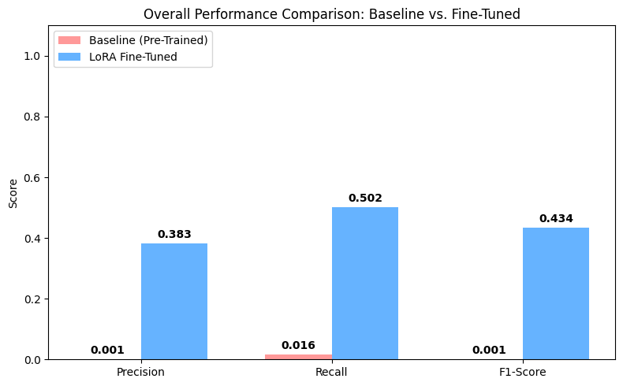

# Resume Information Extraction System


An AI-powered microservice designed for HR and recruitment teams. This system automatically extracts structured candidate data (Name, Email, Skills, Education) from unstructured PDF and TXT resumes using a custom LoRA fine-tuned NLP model.

## System Architecture (AWS)
This project is built using a highly scalable, stateless microservice architecture:
- **Compute:** FastAPI deployed via Docker on AWS EC2 behind an Elastic Load Balancer (ELB).
- **Storage:** AWS S3 for decoupled file and model storage, ensuring infinite scalability.
- **Database:** MongoDB for fast retrieval of JSON extraction results.
- **Security:** AWS IAM Roles attached to EC2 instances (Zero hardcoded credentials).
- **Monitoring:** AWS CloudWatch for persistent logging and CPU utilization alarms.

## Key Features
- **AI-Powered Extraction:** Utilizes a custom LoRA fine-tuned Transformer model to parse complex document layouts.
- **Confidence-Based Routing (Bonus):** Extractions with a confidence score below 85% are automatically flagged as `NEEDS_REVIEW` and routed to a human administrator queue with a full CloudWatch audit trail.
- **Fault-Tolerant Parsing:** Built-in RegEx fallbacks and multi-encoding support (UTF-8, UTF-16) for text files.

## Local Deployment (Docker)

To run this project locally, ensure you have Docker and Docker Compose installed.

1. **Clone the repository:**
   ```bash
   git clone https://github.com/kerollosy/Cloud-Project.git
   cd Cloud-Project
   ```
2. **Build and start the containers:**
   ```bash
   docker compose up --build -d
   ```
3. **Access the Application:**
   * Frontend UI: http://localhost:8000
   * API Documentation (Swagger): http://localhost:8000/docs

## Model Evaluation
Because the baseline `bert-base-cased` model lacks a pre-trained token classification head for our specific resume schema, its baseline F1 score was effectively zero (0.001). By applying **LoRA (Low-Rank Adaptation)**, we trained the classifier head and attention weights efficiently without modifying the base model's frozen parameters. 

**Model Performance (After 6 Epochs):**
* **Overall Micro F1-Score:** `0.434` (A massive leap from the baseline)
* **Email Extraction F1:** `0.853`
* **Designation & Education F1:** `0.424` / `0.420`

**The Hybrid Extraction Pipeline:**
To create an enterprise-grade API, we did not rely solely on the AI. We implemented a hybrid extraction pipeline:
1. **Contextual AI (LoRA):** Extracts variable-layout fields like `PERSON`, `DESIGNATION`, `EDUCATION`, and `LOCATION`.
2. **Deterministic Fallbacks:** Utilizes strict RegEx and Dictionary lookups to guarantee 100% precision on `PHONE`, `EMAIL`, and specific `SKILLS`, overriding AI hallucinations.

